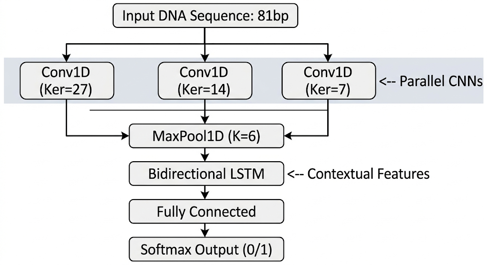

# GPlusD: Prokaryotic Promoter Prediction

The architecture splits Gram-positive and Gram-negative bacterial data, utilizing a parallel convolutional approach followed by a Bidirectional LSTM to capture both local motifs and long-range contextual sequence dependencies.

---

### Model Architecture

The network processes 81-base-pair DNA sequences through parallel 1D convolutions of varying kernel sizes to capture different motif lengths simultaneously. 


---

### Setup & Installation

You can set up your environment using either `conda` or `pip`. The dependencies are kept intentionally light.

```bash
# Using pip
pip install torch pandas torchdata icecream

# Or using conda
conda create -n gplusd python=3.9
conda activate gplusd
pip install torch pandas torchdata icecream
```

---

### Training

You can either grab the pre-trained weights already available in the `output/gplus` and `output/gminus` directories, or train the model from scratch on your own prepared data.

To train the model on your own data, use the following commands:

```bash
# Train on Gram-positive data
python3 train.py -d data/gplus.txt -o gplus

# Train on Gram-negative data
python3 train.py -d data/gminus.txt -o gminus
```
*(Note: The `-o` flag specifies the name of the subfolder inside the `./output/` directory where your model checkpoints and logs will be saved.)*

---

### Running Inference

To test your own sequences, you'll need to prepare a plain text dataset. 

1. Create a `.txt` file where **each line contains exactly one 81-length DNA sequence**.
2. Run inference by pointing the script to your data and the appropriate pre-trained weights. 

```bash
python3 test.py -d data/your_sequences.txt -w output/gplus/best_mcc.pth
```

The model will process the sequences and drop the predictions into `infer_results.txt` in your main folder.

---

### Implementation Details

Here is what makes GPlusD rock:

#### 1. The Negative Sampling Strategy
In addition to standard negative sampling (to be described in the Preprocessing section of the paper), I added a random dataset to help the model generalize. 

- actual iteration of the negative sampling strategy
    - I first used RefSeq for example the B. subtilis 168 refseq on GENBank to make a list of background sequences for all the positive seq using the promoter positions (indices in the SeqRecord) - Let's just say model performance was OK.
    - Then I stumbled upon DeePromoter which influenced greatly architectural decisions and particularly the negative sampling...

To force the model to truly learn spatial relationships and regulatory motifs rather than just memorizing base-pair compositions, we engineered a custom negative sampling strategy. We take an 81bp sequence and split it into 5 chunks (four 16bp chunks and one 17bp chunk). We **lock 2 chunks** in their original spatial positions and **randomly shuffle the remaining 3** (48bp total). 

#### 2. Parallel Convolution Parameters
Instead of utilizing grid search to find optimal parameters for the network, I directly implemented the final set of parameters from the literature. This includes parallel CNN kernel sizes of `[27, 14, 7]` and a max-pooling kernel of `6`.

---

### Data Sources & Citations

The datasets used to train and validate GPlusD were sourced from the Prokaryotic Promoter Database (PPD) and the DBTBS database. If you use this work, please cite the original data sources:

**Prokaryotic Promoter Database (PPD):**
```bibtex
@article{SU2021166860,
  title = {PPD: A Manually Curated Database for Experimentally Verified Prokaryotic Promoters},
  journal = {Journal of Molecular Biology},
  volume = {433},
  number = {11},
  pages = {166860},
  year = {2021},
  author = {Wei Su and Meng-Lu Liu and Yu-He Yang and Jia-Shu Wang and Shi-Hao Li and Hao Lv and Fu-Ying Dao and Hui Yang and Hao Lin},
  doi = {[https://doi.org/10.1016/j.jmb.2021.166860](https://doi.org/10.1016/j.jmb.2021.166860)}
}
```

**Bacillus subtilis Independent Benchmark Dataset (DBTBS):**
```bibtex
@article{sierro2008dbtbs,
  title={DBTBS: a database of transcriptional regulation in Bacillus subtilis containing upstream intergenic conservation information},
  author={Sierro, Nicolas and Makita, Yuko and de Hoon, Michiel and Nakai, Kenta},
  journal={Nucleic acids research},
  volume={36},
  number={suppl_1},
  pages={D93--D96},
  year={2008},
  publisher={Oxford University Press}
}
```

**DeePromoter:**
```bibtex
@article{oubounyt2019deepromoter,
  title={DeePromoter: robust promoter predictor using deep learning},
  author={Oubounyt, Mhaned and Louadi, Zakaria and Tayara, Hilal and Chong, Kil To},
  journal={Frontiers in genetics},
  volume={10},
  pages={286},
  year={2019},
  publisher={Frontiers Media SA}
}
```